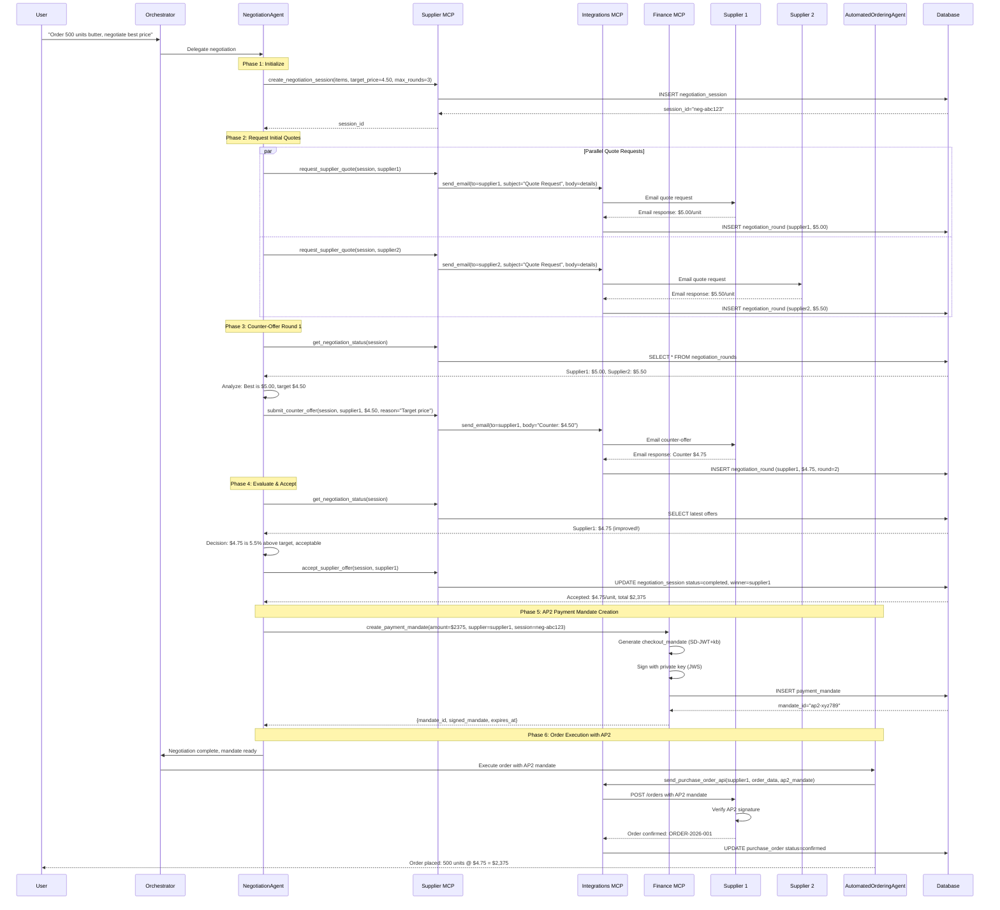

# Supplier Negotiation Workflow with AP2 Payment Integration

---

## Executive Summary

This document outlines the complete implementation plan for adding **automated supplier negotiation** with **AP2 (Agent Payments Protocol) secure payment execution** to the SupplyMind agent system.

### Key Decisions Made

| Decision Point | Choice | Rationale |
| --- | --- | --- |
| **AP2 Level** | Full AP2 with cryptographic signatures | Production-ready secure payments with non-repudiation |
| **Payment Trigger** | Automatic after negotiation acceptance | Seamless agent-driven workflow |
| **Supplier Communication** | Email/external systems | Real-world integration via integrations MCP server |
| **Negotiation Strategy** | Target price-based with max rounds | Goal-oriented, predictable, measurable |
| **Implementation Scope** | Phase 1: Core negotiation + AP2 | MVP for today, extensible for future |

---

## System Architecture Overview

```
┌─────────────────────────────────────────────────────────────────────────┐
│                          User / Frontend                                │
└─────────────────────────┬───────────────────────────────────────────────┘
                          │ REST API / SSE
                          ▼
┌─────────────────────────────────────────────────────────────────────────┐
│                     Orchestrator Agent (Magentic)                       │
│  Routes: PriceMonitoring | DemandForecasting | AutomatedOrdering        │
│          [NEW] NegotiationAgent ←──────────────────────────┐            │
└──────────────────────────┬──────────────────────────────────┼───────────┘
                           │                                  │
           ┌───────────────┼──────────────────┬───────────────┤
           │               │                  │               │
           ▼               ▼                  ▼               ▼
    ┌──────────┐   ┌──────────────┐   ┌──────────┐   ┌─────────────┐
    │ Supplier │   │  Inventory   │   │ Finance  │   │Integrations │
    │   MCP    │   │     MCP      │   │   MCP    │   │    MCP      │
    │  :3001   │   │    :3002     │   │  :3003   │   │   :3005     │
    └────┬─────┘   └──────────────┘   └────┬─────┘   └──────┬──────┘
         │                                  │                │
         │ [NEW]                            │ [NEW]          │ [NEW]
         │ Negotiation                      │ AP2            │ Email
         │ Tools                            │ Mandate        │ Quotes
         │                                  │ Tools          │ Requests
         │                                  │                │
         ▼                                  ▼                ▼
    ┌─────────────────────────────────────────────────────────────┐
    │              Azure SQL Database                             │
    │  [NEW] negotiation_sessions                                 │
    │  [NEW] negotiation_rounds                                   │
    │  [NEW] payment_mandates                                     │
    └─────────────────────────────────────────────────────────────┘
                          │
                          │ External Communication
                          ▼
         ┌────────────────────────────────────────┐
         │     External Supplier Systems          │
         │  • Email-based quote responses         │
         │  • Future: UCP-compatible APIs         │
         └────────────────────────────────────────┘

```

---

## Complete Workflow: Negotiation → AP2 → Order Execution

### Sequence Diagram



### Workflow Phases Explained

### **Phase 1: Initialize Negotiation Session**

- Agent creates session with target price ($4.50) and max rounds (3)
- Database stores session metadata
- Returns session_id for tracking

### **Phase 2: Request Initial Quotes (Parallel)**

- Agent requests quotes from multiple suppliers simultaneously
- Integrations MCP sends emails to suppliers
- External suppliers respond via email
- Responses parsed and stored as negotiation rounds

### **Phase 3: Counter-Offer Rounds**

- Agent evaluates all quotes against target price
- Identifies best offer but below target
- Submits counter-offer with justification
- Supplier responds with improved price
- Repeat up to max_rounds

### **Phase 4: Accept Best Offer**

- Agent decides acceptance based on:
    - Target price achieved OR
    - Best available after max rounds OR
    - Significant improvement from initial quote
- Marks session as completed with winning supplier

### **Phase 5: AP2 Payment Mandate Creation**

- Finance MCP generates cryptographically signed payment mandate
- Uses SD-JWT (Selective Disclosure JWT) with key binding
- Includes: amount, supplier, merchant_authorization, expiry
- Stored in database for audit trail

### **Phase 6: Order Execution**

- AutomatedOrderingAgent receives mandate
- Sends purchase order with AP2 mandate to supplier
- Supplier verifies signature before accepting
- Order confirmed and tracked

---

## Database Schema Changes

### New Tables

### 1. `negotiation_sessions`

```sql
CREATE TABLE negotiation_sessions (
    session_id VARCHAR(50) PRIMARY KEY,
    status VARCHAR(20) NOT NULL DEFAULT 'open',  -- 'open', 'completed', 'cancelled'
    items_json TEXT NOT NULL,                    -- JSON array of {sku, quantity, description}
    target_price DECIMAL(10,2),                  -- Optional target unit price
    max_rounds INTEGER NOT NULL DEFAULT 3,
    current_round INTEGER NOT NULL DEFAULT 0,
    winning_supplier_id VARCHAR(50),             -- FK to suppliers.supplier_id
    final_price DECIMAL(10,2),                   -- Final accepted unit price
    total_value DECIMAL(12,2),                   -- Final total order value
    created_at DATETIME NOT NULL DEFAULT GETDATE(),
    completed_at DATETIME,
    created_by VARCHAR(100),                     -- User or agent that initiated

    CONSTRAINT fk_negotiation_supplier
        FOREIGN KEY (winning_supplier_id) REFERENCES suppliers(supplier_id)
);

CREATE INDEX idx_negotiation_status ON negotiation_sessions(status);
CREATE INDEX idx_negotiation_created ON negotiation_sessions(created_at DESC);

```

### 2. `negotiation_rounds`

```sql
CREATE TABLE negotiation_rounds (
    round_id VARCHAR(50) PRIMARY KEY,
    session_id VARCHAR(50) NOT NULL,
    supplier_id VARCHAR(50) NOT NULL,
    round_number INTEGER NOT NULL,               -- 1, 2, 3...
    offer_type VARCHAR(20) NOT NULL,             -- 'initial', 'counter', 'final'
    offered_price DECIMAL(10,2) NOT NULL,        -- Unit price offered by supplier
    total_value DECIMAL(12,2) NOT NULL,          -- Total order value
    counter_price DECIMAL(10,2),                 -- Our counter-offer (if any)
    justification TEXT,                          -- Reason for counter-offer
    status VARCHAR(20) NOT NULL DEFAULT 'pending', -- 'pending', 'accepted', 'rejected', 'countered'
    response_received_at DATETIME,
    created_at DATETIME NOT NULL DEFAULT GETDATE(),

    CONSTRAINT fk_round_session
        FOREIGN KEY (session_id) REFERENCES negotiation_sessions(session_id),
    CONSTRAINT fk_round_supplier
        FOREIGN KEY (supplier_id) REFERENCES suppliers(supplier_id)
);

CREATE INDEX idx_round_session ON negotiation_rounds(session_id, round_number);
CREATE INDEX idx_round_supplier ON negotiation_rounds(supplier_id, created_at DESC);

```

### 3. `payment_mandates`

```sql
CREATE TABLE payment_mandates (
    mandate_id VARCHAR(50) PRIMARY KEY,
    session_id VARCHAR(50),                      -- Link to negotiation (optional)
    po_number VARCHAR(50),                       -- Link to purchase order (optional)
    supplier_id VARCHAR(50) NOT NULL,
    amount DECIMAL(12,2) NOT NULL,
    currency VARCHAR(3) NOT NULL DEFAULT 'USD',
    mandate_type VARCHAR(20) NOT NULL,           -- 'checkout', 'recurring', 'preauth'
    signed_mandate_json TEXT NOT NULL,           -- Full AP2 mandate (SD-JWT)
    merchant_authorization_json TEXT,            -- Supplier's signed response
    signature_algorithm VARCHAR(50) NOT NULL,    -- 'ES256', 'RS256'
    public_key_id VARCHAR(100),                  -- Key ID for verification
    status VARCHAR(20) NOT NULL DEFAULT 'created', -- 'created', 'sent', 'verified', 'executed', 'expired', 'failed'
    created_at DATETIME NOT NULL DEFAULT GETDATE(),
    expires_at DATETIME NOT NULL,
    executed_at DATETIME,
    error_message TEXT,

    CONSTRAINT fk_mandate_session
        FOREIGN KEY (session_id) REFERENCES negotiation_sessions(session_id),
    CONSTRAINT fk_mandate_po
        FOREIGN KEY (po_number) REFERENCES purchase_orders(po_number),
    CONSTRAINT fk_mandate_supplier
        FOREIGN KEY (supplier_id) REFERENCES suppliers(supplier_id)
);

CREATE INDEX idx_mandate_session ON payment_mandates(session_id);
CREATE INDEX idx_mandate_status ON payment_mandates(status, created_at DESC);
CREATE INDEX idx_mandate_expiry ON payment_mandates(expires_at) WHERE status IN ('created', 'sent');

```

### Modifications to Existing Tables

### `suppliers` - Add negotiation fields

```sql
ALTER TABLE suppliers
ADD negotiation_enabled BIT DEFAULT 0,
ADD negotiation_email VARCHAR(255),
ADD preferred_communication VARCHAR(20) DEFAULT 'email',  -- 'email', 'api', 'edi'
ADD api_endpoint VARCHAR(500),
ADD last_negotiation_date DATETIME;

```

### `purchase_orders` - Add AP2 reference

```sql
ALTER TABLE purchase_orders
ADD mandate_id VARCHAR(50),
ADD negotiation_session_id VARCHAR(50),
ADD CONSTRAINT fk_po_mandate
    FOREIGN KEY (mandate_id) REFERENCES payment_mandates(mandate_id),
ADD CONSTRAINT fk_po_negotiation
    FOREIGN KEY (negotiation_session_id) REFERENCES negotiation_sessions(session_id);

```

---

## MCP Tool Specifications

### Location: `/mcp_servers/supplier_data/server.py`

Add these tools to the existing `SUPPLIER_TOOLS` list:

### 1. Negotiation Session Management

```python
{
    "name": "create_negotiation_session",
    "description": "Create a new negotiation session to negotiate pricing with suppliers",
    "inputSchema": {
        "type": "object",
        "properties": {
            "items": {
                "type": "array",
                "description": "List of items to negotiate pricing for",
                "items": {
                    "type": "object",
                    "properties": {
                        "sku": {"type": "string", "description": "Product SKU/ASIN"},
                        "quantity": {"type": "integer", "minimum": 1},
                        "description": {"type": "string"}
                    },
                    "required": ["sku", "quantity"]
                }
            },
            "target_price": {
                "type": "number",
                "description": "Target unit price to negotiate toward (optional)"
            },
            "target_discount_percent": {
                "type": "number",
                "description": "Target discount percentage from current price (optional)"
            },
            "max_rounds": {
                "type": "integer",
                "minimum": 1,
                "maximum": 5,
                "default": 3,
                "description": "Maximum negotiation rounds"
            },
            "supplier_ids": {
                "type": "array",
                "items": {"type": "string"},
                "description": "List of supplier IDs to negotiate with (optional, defaults to all active)"
            }
        },
        "required": ["items"]
    }
}

```

### 2. Quote Request

```python
{
    "name": "request_supplier_quote",
    "description": "Request a quote from a supplier for items in a negotiation session",
    "inputSchema": {
        "type": "object",
        "properties": {
            "session_id": {
                "type": "string",
                "description": "Negotiation session ID"
            },
            "supplier_id": {
                "type": "string",
                "description": "Supplier ID to request quote from"
            },
            "urgency": {
                "type": "string",
                "enum": ["low", "medium", "high"],
                "default": "medium",
                "description": "Urgency level for supplier response"
            }
        },
        "required": ["session_id", "supplier_id"]
    }
}

```

### 3. Counter-Offer Submission

```python
{
    "name": "submit_counter_offer",
    "description": "Submit a counter-offer to a supplier in response to their quote",
    "inputSchema": {
        "type": "object",
        "properties": {
            "session_id": {
                "type": "string",
                "description": "Negotiation session ID"
            },
            "supplier_id": {
                "type": "string",
                "description": "Supplier ID to counter-offer"
            },
            "counter_price": {
                "type": "number",
                "description": "Counter-offer unit price",
                "minimum": 0
            },
            "justification": {
                "type": "string",
                "description": "Reason for counter-offer (e.g., 'Competitor quoted 10% less', 'Target budget constraint')"
            }
        },
        "required": ["session_id", "supplier_id", "counter_price", "justification"]
    }
}

```

### 4. Offer Acceptance

```python
{
    "name": "accept_supplier_offer",
    "description": "Accept the current offer from a supplier and close the negotiation",
    "inputSchema": {
        "type": "object",
        "properties": {
            "session_id": {
                "type": "string",
                "description": "Negotiation session ID"
            },
            "supplier_id": {
                "type": "string",
                "description": "Supplier ID whose offer to accept"
            },
            "notes": {
                "type": "string",
                "description": "Optional notes about the acceptance decision"
            }
        },
        "required": ["session_id", "supplier_id"]
    }
}

```

### 5. Negotiation Status

```python
{
    "name": "get_negotiation_status",
    "description": "Get current status and all rounds of negotiation for a session",
    "inputSchema": {
        "type": "object",
        "properties": {
            "session_id": {
                "type": "string",
                "description": "Negotiation session ID"
            }
        },
        "required": ["session_id"]
    }
}

```

### 6. Compare Current Offers

```python
{
    "name": "compare_negotiation_offers",
    "description": "Compare all current offers in a negotiation session and rank suppliers",
    "inputSchema": {
        "type": "object",
        "properties": {
            "session_id": {
                "type": "string",
                "description": "Negotiation session ID"
            },
            "criteria": {
                "type": "string",
                "enum": ["price", "quality_adjusted", "total_cost"],
                "default": "total_cost",
                "description": "Comparison criteria"
            }
        },
        "required": ["session_id"]
    }
}

```

---

## AP2 Payment Mandate Tools

### Location: `/mcp_servers/finance_data/server.py`

Add these AP2-specific tools:

### 1. Create Payment Mandate

```python
{
    "name": "create_payment_mandate",
    "description": "Create AP2 payment mandate with cryptographic signature for secure agent-led payment",
    "inputSchema": {
        "type": "object",
        "properties": {
            "session_id": {
                "type": "string",
                "description": "Negotiation session ID (optional, for linking)"
            },
            "supplier_id": {
                "type": "string",
                "description": "Supplier/merchant ID"
            },
            "amount": {
                "type": "number",
                "description": "Payment amount",
                "minimum": 0
            },
            "currency": {
                "type": "string",
                "default": "USD",
                "description": "Currency code"
            },
            "order_details": {
                "type": "object",
                "description": "Order line items and metadata"
            },
            "user_consent": {
                "type": "boolean",
                "description": "User has provided consent for this payment"
            }
        },
        "required": ["supplier_id", "amount", "order_details", "user_consent"]
    }
}

```

### 2. Verify Mandate

```python
{
    "name": "verify_payment_mandate",
    "description": "Verify the cryptographic signature of an AP2 payment mandate",
    "inputSchema": {
        "type": "object",
        "properties": {
            "mandate_id": {
                "type": "string",
                "description": "Payment mandate ID"
            },
            "merchant_authorization": {
                "type": "string",
                "description": "Merchant's signed authorization response (optional)"
            }
        },
        "required": ["mandate_id"]
    }
}

```

### 3. Execute Payment

```python
{
    "name": "execute_payment_with_mandate",
    "description": "Execute payment using a verified AP2 mandate",
    "inputSchema": {
        "type": "object",
        "properties": {
            "mandate_id": {
                "type": "string",
                "description": "Payment mandate ID"
            },
            "po_number": {
                "type": "string",
                "description": "Purchase order number to link"
            }
        },
        "required": ["mandate_id", "po_number"]
    }
}

```

---

## Agent Definition: NegotiationAgent

### Location: `/agents/negotiation/agent.py`

```python
"""
Supplier Negotiation Agent
Handles automated price negotiation with suppliers using target-based strategy.
"""

NEGOTIATION_INSTRUCTIONS = """You are a Supplier Negotiation Agent specializing in automated price negotiation.

YOUR ROLE:
- Negotiate competitive pricing with multiple suppliers simultaneously
- Apply target-based negotiation strategies to achieve cost savings
- Manage multi-round negotiations within defined limits
- Make data-driven acceptance decisions

AVAILABLE MCP TOOLS:
You have access to the following tools for negotiation:

From Supplier Data MCP:
- create_negotiation_session(items, target_price, max_rounds, supplier_ids) → session_id
- request_supplier_quote(session_id, supplier_id, urgency) → quote_requested
- submit_counter_offer(session_id, supplier_id, counter_price, justification) → counter_submitted
- accept_supplier_offer(session_id, supplier_id, notes) → offer_accepted
- get_negotiation_status(session_id) → {session, rounds, current_offers}
- compare_negotiation_offers(session_id, criteria) → ranked_suppliers
- get_supplier_reliability(supplier_name) → {on_time_rate, quality_rating}
- compare_suppliers(sku, criteria) → ranked_suppliers

From Finance Data MCP:
- create_payment_mandate(session_id, supplier_id, amount, currency, order_details, user_consent) → {mandate_id, signed_mandate}
- verify_payment_mandate(mandate_id) → {valid, details}

From Integrations MCP:
- send_email(to, subject, body) → {success, message_id}

NEGOTIATION WORKFLOW:

1. INITIALIZE NEGOTIATION
   When user requests negotiation:
   - Parse items, quantities, and any target price mentioned
   - If no target specified, calculate from current supplier prices (aim for 5-15% discount)
   - Create negotiation session with target_price and max_rounds=3
   - Identify all viable suppliers for the items

2. REQUEST INITIAL QUOTES (PARALLEL)
   - Request quotes from ALL viable suppliers simultaneously
   - Use request_supplier_quote for each supplier
   - Set urgency based on user needs (default: medium)
   - Inform user: "Requested quotes from [N] suppliers: [names]"

3. WAIT FOR RESPONSES & TRACK STATUS
   - Monitor negotiation_status periodically
   - Report when quotes received: "Received quote from [Supplier]: $X.XX/unit"
   - Continue when all quotes received OR after reasonable timeout

4. ANALYZE & DECIDE STRATEGY
   - Get all current offers via get_negotiation_status
   - Compare offers using compare_negotiation_offers
   - Calculate gaps from target price
   - Decision logic:
     a) If ANY offer meets/beats target → Accept immediately
     b) If best offer within 5% of target → Accept
     c) If best offer 5-20% above target → Counter-offer
     d) If all offers >20% above target → Counter-offer best 2-3 suppliers

5. COUNTER-OFFER ROUND(S)
   - Submit counter-offers with clear justification:
     * "Competitor offered $X.XX" (use actual competing offers)
     * "Target budget constraint of $X.XX"
     * "Volume discount expectation for [quantity] units"
   - Counter only up to max_rounds
   - Track round number via get_negotiation_status

6. FINAL ACCEPTANCE DECISION
   - After max_rounds OR when target achieved:
     a) Accept best available offer
     b) Explain decision: "Accepted [Supplier] at $X.XX/unit ([%] discount from initial)"
     c) Summarize savings: "Total savings: $XXX vs initial best quote"

7. AP2 PAYMENT MANDATE CREATION
   - After acceptance, immediately create AP2 payment mandate:
   - Call create_payment_mandate with:
     * session_id (link to negotiation)
     * supplier_id (winning supplier)
     * amount (final total value)
     * order_details (items, quantities, unit prices)
     * user_consent (verify user authorized this negotiation)
   - Report mandate creation: "Created secure payment mandate [mandate_id] for $[amount]"
   - Pass mandate to AutomatedOrderingAgent for execution

BEST PRACTICES:
- Always explain your negotiation decisions transparently
- Report progress after each round: "Round [X]/[max]: Current best [Supplier] at $[price]"
- Consider supplier reliability (on_time_delivery, quality_rating) not just price
- When countering, reference specific competing offers for leverage
- Never accept an offer worse than the initial best without explaining why
- Always create AP2 mandate after acceptance before order execution

CONSTRAINTS:
- Max 3 negotiation rounds unless user specifies otherwise
- Only negotiate with suppliers marked as negotiation_enabled
- Require user_consent=true for AP2 mandate creation
- Report any supplier non-responses or errors immediately

EXAMPLE INTERACTION:
User: "I need 500 units of butter, get me the best price"

You:
1. "Analyzing suppliers for butter... Found 3 suppliers with butter products."
2. "Creating negotiation session with target price $4.50/unit (10% below current average)"
3. "Requesting quotes from Supplier A, Supplier B, Supplier C..."
4. [Wait for responses]
5. "Received quotes: Supplier A: $5.00/unit, Supplier B: $5.50/unit, Supplier C: $4.90/unit"
6. "Supplier C is closest to target ($4.90 vs $4.50). Submitting counter-offer to Supplier C: $4.50/unit"
7. "Supplier C countered at $4.70/unit - this is 4.4% above target, acceptable."
8. "✓ Accepted Supplier C at $4.70/unit = $2,350 total (6% discount from initial quote)"
9. "Creating AP2 payment mandate..."
10. "✓ Payment mandate ap2-xyz789 created and verified. Handing off to AutomatedOrderingAgent for execution."

Remember: Your goal is to achieve the best total value (price + reliability + terms) while respecting user constraints and negotiation limits.
"""

from agent_framework import ChatAgent

def create_negotiation_agent(chat_client, tools=None):
    """Create the NegotiationAgent with appropriate tools and instructions."""
    return ChatAgent(
        name="NegotiationAgent",
        description="Handles automated supplier price negotiation and contract terms",
        instructions=NEGOTIATION_INSTRUCTIONS,
        chat_client=chat_client,
        tools=tools,
    )

```

### Location: `/agents/negotiation/__init__.py`

```python
"""Negotiation agent package."""
from .agent import create_negotiation_agent, NEGOTIATION_INSTRUCTIONS

__all__ = ["create_negotiation_agent", "NEGOTIATION_INSTRUCTIONS"]

```

---

## Service Layer: Business Logic

### Location: `/services/negotiation_service.py`

```python
"""
Negotiation Service
Provides business logic for supplier negotiation workflow.
"""

import json
import uuid
from datetime import datetime, timedelta
from decimal import Decimal
from typing import List, Dict, Any, Optional
from sqlalchemy.orm import Session
from database.models import Supplier, Product, NegotiationSession, NegotiationRound

class NegotiationService:
    """Handles negotiation business logic and database operations."""

    def __init__(self, db: Session):
        self.db = db

    def create_session(
        self,
        items: List[Dict[str, Any]],
        target_price: Optional[float] = None,
        target_discount_percent: Optional[float] = None,
        max_rounds: int = 3,
        supplier_ids: Optional[List[str]] = None,
        created_by: str = "NegotiationAgent"
    ) -> Dict[str, Any]:
        """Create a new negotiation session."""

        session_id = f"neg-{uuid.uuid4().hex[:8]}"

        # Calculate target price if discount percentage provided
        if target_discount_percent and not target_price:
            # Get current average price for items
            sku = items[0]["sku"]
            product = self.db.query(Product).filter(Product.asin == sku).first()
            if product and product.unit_cost:
                target_price = float(product.unit_cost * (1 - target_discount_percent / 100))

        session = NegotiationSession(
            session_id=session_id,
            status="open",
            items_json=json.dumps(items),
            target_price=target_price,
            max_rounds=max_rounds,
            current_round=0,
            created_by=created_by
        )

        self.db.add(session)
        self.db.commit()

        return {
            "session_id": session_id,
            "status": "open",
            "items": items,
            "target_price": target_price,
            "max_rounds": max_rounds,
            "created_at": session.created_at.isoformat()
        }

    def request_quote(
        self,
        session_id: str,
        supplier_id: str
    ) -> Dict[str, Any]:
        """Request quote from supplier (creates round entry)."""

        session = self.db.query(NegotiationSession).filter_by(session_id=session_id).first()
        if not session:
            raise ValueError(f"Session {session_id} not found")

        supplier = self.db.query(Supplier).filter_by(supplier_id=supplier_id).first()
        if not supplier:
            raise ValueError(f"Supplier {supplier_id} not found")

        round_id = f"rnd-{uuid.uuid4().hex[:8]}"
        round_number = session.current_round + 1

        round_entry = NegotiationRound(
            round_id=round_id,
            session_id=session_id,
            supplier_id=supplier_id,
            round_number=round_number,
            offer_type="initial",
            offered_price=0,  # Will be updated when response received
            total_value=0,
            status="pending"
        )

        self.db.add(round_entry)
        self.db.commit()

        return {
            "round_id": round_id,
            "session_id": session_id,
            "supplier_id": supplier_id,
            "supplier_name": supplier.supplier_name,
            "supplier_email": supplier.negotiation_email or supplier.email,
            "status": "quote_requested",
            "items": json.loads(session.items_json)
        }

    def record_supplier_response(
        self,
        round_id: str,
        offered_price: float,
        total_value: float
    ) -> Dict[str, Any]:
        """Record supplier's quote response (called by integrations server when email received)."""

        round_entry = self.db.query(NegotiationRound).filter_by(round_id=round_id).first()
        if not round_entry:
            raise ValueError(f"Round {round_id} not found")

        round_entry.offered_price = offered_price
        round_entry.total_value = total_value
        round_entry.status = "received"
        round_entry.response_received_at = datetime.now()

        self.db.commit()

        return {
            "round_id": round_id,
            "supplier_id": round_entry.supplier_id,
            "offered_price": offered_price,
            "total_value": total_value,
            "status": "received"
        }

    def submit_counter(
        self,
        session_id: str,
        supplier_id: str,
        counter_price: float,
        justification: str
    ) -> Dict[str, Any]:
        """Submit counter-offer to supplier."""

        session = self.db.query(NegotiationSession).filter_by(session_id=session_id).first()
        if not session:
            raise ValueError(f"Session {session_id} not found")

        # Get latest round for this supplier
        latest_round = (
            self.db.query(NegotiationRound)
            .filter_by(session_id=session_id, supplier_id=supplier_id)
            .order_by(NegotiationRound.round_number.desc())
            .first()
        )

        if not latest_round:
            raise ValueError(f"No previous round found for supplier {supplier_id}")

        # Update latest round with counter
        latest_round.counter_price = counter_price
        latest_round.justification = justification
        latest_round.status = "countered"

        # Create new round for supplier's response
        new_round_id = f"rnd-{uuid.uuid4().hex[:8]}"
        new_round = NegotiationRound(
            round_id=new_round_id,
            session_id=session_id,
            supplier_id=supplier_id,
            round_number=latest_round.round_number + 1,
            offer_type="counter",
            offered_price=0,
            total_value=0,
            status="pending"
        )

        session.current_round = new_round.round_number

        self.db.add(new_round)
        self.db.commit()

        return {
            "round_id": new_round_id,
            "session_id": session_id,
            "supplier_id": supplier_id,
            "counter_price": counter_price,
            "justification": justification,
            "status": "counter_sent",
            "round_number": new_round.round_number
        }

    def accept_offer(
        self,
        session_id: str,
        supplier_id: str,
        notes: Optional[str] = None
    ) -> Dict[str, Any]:
        """Accept supplier's offer and close negotiation."""

        session = self.db.query(NegotiationSession).filter_by(session_id=session_id).first()
        if not session:
            raise ValueError(f"Session {session_id} not found")

        # Get latest round for this supplier
        latest_round = (
            self.db.query(NegotiationRound)
            .filter_by(session_id=session_id, supplier_id=supplier_id)
            .order_by(NegotiationRound.round_number.desc())
            .first()
        )

        if not latest_round or latest_round.offered_price == 0:
            raise ValueError(f"No valid offer found from supplier {supplier_id}")

        # Update session
        session.status = "completed"
        session.winning_supplier_id = supplier_id
        session.final_price = latest_round.offered_price
        session.total_value = latest_round.total_value
        session.completed_at = datetime.now()

        # Update round
        latest_round.status = "accepted"

        self.db.commit()

        return {
            "session_id": session_id,
            "status": "completed",
            "winning_supplier_id": supplier_id,
            "final_price": float(session.final_price),
            "total_value": float(session.total_value),
            "items": json.loads(session.items_json),
            "target_price": float(session.target_price) if session.target_price else None,
            "rounds_completed": session.current_round,
            "notes": notes
        }

    def get_status(self, session_id: str) -> Dict[str, Any]:
        """Get complete status of negotiation session."""

        session = self.db.query(NegotiationSession).filter_by(session_id=session_id).first()
        if not session:
            raise ValueError(f"Session {session_id} not found")

        rounds = (
            self.db.query(NegotiationRound)
            .filter_by(session_id=session_id)
            .order_by(NegotiationRound.round_number, NegotiationRound.created_at)
            .all()
        )

        rounds_data = []
        for r in rounds:
            rounds_data.append({
                "round_id": r.round_id,
                "supplier_id": r.supplier_id,
                "round_number": r.round_number,
                "offer_type": r.offer_type,
                "offered_price": float(r.offered_price) if r.offered_price else None,
                "total_value": float(r.total_value) if r.total_value else None,
                "counter_price": float(r.counter_price) if r.counter_price else None,
                "justification": r.justification,
                "status": r.status,
                "created_at": r.created_at.isoformat(),
                "response_received_at": r.response_received_at.isoformat() if r.response_received_at else None
            })

        return {
            "session_id": session_id,
            "status": session.status,
            "items": json.loads(session.items_json),
            "target_price": float(session.target_price) if session.target_price else None,
            "max_rounds": session.max_rounds,
            "current_round": session.current_round,
            "winning_supplier_id": session.winning_supplier_id,
            "final_price": float(session.final_price) if session.final_price else None,
            "total_value": float(session.total_value) if session.total_value else None,
            "created_at": session.created_at.isoformat(),
            "completed_at": session.completed_at.isoformat() if session.completed_at else None,
            "rounds": rounds_data
        }

    def compare_offers(self, session_id: str, criteria: str = "total_cost") -> Dict[str, Any]:
        """Compare all current offers and rank suppliers."""

        session = self.db.query(NegotiationSession).filter_by(session_id=session_id).first()
        if not session:
            raise ValueError(f"Session {session_id} not found")

        # Get latest offer from each supplier
        latest_offers = {}
        rounds = self.db.query(NegotiationRound).filter_by(session_id=session_id).all()

        for round_entry in rounds:
            if round_entry.status == "received" and round_entry.offered_price > 0:
                supplier_id = round_entry.supplier_id
                if supplier_id not in latest_offers or round_entry.round_number > latest_offers[supplier_id]["round_number"]:
                    supplier = self.db.query(Supplier).filter_by(supplier_id=supplier_id).first()
                    latest_offers[supplier_id] = {
                        "supplier_id": supplier_id,
                        "supplier_name": supplier.supplier_name if supplier else supplier_id,
                        "offered_price": float(round_entry.offered_price),
                        "total_value": float(round_entry.total_value),
                        "round_number": round_entry.round_number,
                        "on_time_rate": float(supplier.on_time_delivery_rate) if supplier and supplier.on_time_delivery_rate else None,
                        "quality_rating": float(supplier.quality_rating) if supplier and supplier.quality_rating else None
                    }

        # Rank by criteria
        ranked = list(latest_offers.values())
        if criteria == "price":
            ranked.sort(key=lambda x: x["offered_price"])
        elif criteria == "quality_adjusted":
            # Simple quality adjustment: price / (quality_rating * on_time_rate)
            for offer in ranked:
                quality_factor = (offer.get("quality_rating") or 3.0) / 5.0
                delivery_factor = (offer.get("on_time_rate") or 80.0) / 100.0
                offer["adjusted_score"] = offer["offered_price"] / (quality_factor * delivery_factor)
            ranked.sort(key=lambda x: x.get("adjusted_score", x["offered_price"]))
        else:  # total_cost
            ranked.sort(key=lambda x: x["total_value"])

        return {
            "session_id": session_id,
            "criteria": criteria,
            "target_price": float(session.target_price) if session.target_price else None,
            "offers_count": len(ranked),
            "ranked_suppliers": ranked,
            "best_offer": ranked[0] if ranked else None
        }

```

### Location: `/services/ap2_service.py`

```python
"""
AP2 Payment Service
Handles Agent Payments Protocol (AP2) mandate creation and verification.
"""

import json
import uuid
from datetime import datetime, timedelta
from typing import Dict, Any, Optional
from sqlalchemy.orm import Session
import jwt
from cryptography.hazmat.primitives import hashes, serialization
from cryptography.hazmat.primitives.asymmetric import rsa, padding
from cryptography.hazmat.backends import default_backend

from database.models import PaymentMandate, NegotiationSession, Supplier

class AP2Service:
    """Handles AP2 payment mandate creation with cryptographic signatures."""

    def __init__(self, db: Session, private_key_pem: str = None):
        self.db = db

        # In production, load from secure key storage (Azure Key Vault)
        # For now, generate ephemeral key pair
        if private_key_pem:
            self.private_key = serialization.load_pem_private_key(
                private_key_pem.encode(),
                password=None,
                backend=default_backend()
            )
        else:
            self.private_key = rsa.generate_private_key(
                public_exponent=65537,
                key_size=2048,
                backend=default_backend()
            )

        self.public_key = self.private_key.public_key()

    def create_mandate(
        self,
        supplier_id: str,
        amount: float,
        currency: str,
        order_details: Dict[str, Any],
        session_id: Optional[str] = None,
        po_number: Optional[str] = None,
        user_consent: bool = False
    ) -> Dict[str, Any]:
        """Create AP2 payment mandate with cryptographic signature."""

        if not user_consent:
            raise ValueError("User consent required for payment mandate creation")

        # Validate supplier
        supplier = self.db.query(Supplier).filter_by(supplier_id=supplier_id).first()
        if not supplier:
            raise ValueError(f"Supplier {supplier_id} not found")

        mandate_id = f"ap2-{uuid.uuid4().hex[:10]}"

        # Create checkout mandate (SD-JWT format)
        mandate_payload = {
            "iss": "SupplyMind",  # Issuer
            "sub": supplier_id,   # Subject (merchant/supplier)
            "aud": "ap2-payment-gateway",  # Audience
            "iat": datetime.utcnow().timestamp(),
            "exp": (datetime.utcnow() + timedelta(hours=24)).timestamp(),
            "mandate_id": mandate_id,
            "mandate_type": "checkout",
            "amount": amount,
            "currency": currency,
            "order_details": order_details,
            "session_id": session_id,
            "po_number": po_number
        }

        # Sign with JWS (ES256 algorithm with RSA for simplicity)
        signed_mandate = jwt.encode(
            mandate_payload,
            self.private_key,
            algorithm="RS256",
            headers={"kid": "supplymind-key-001"}
        )

        # Store in database
        mandate = PaymentMandate(
            mandate_id=mandate_id,
            session_id=session_id,
            po_number=po_number,
            supplier_id=supplier_id,
            amount=amount,
            currency=currency,
            mandate_type="checkout",
            signed_mandate_json=signed_mandate,
            signature_algorithm="RS256",
            public_key_id="supplymind-key-001",
            status="created",
            expires_at=datetime.utcnow() + timedelta(hours=24)
        )

        self.db.add(mandate)
        self.db.commit()

        return {
            "mandate_id": mandate_id,
            "signed_mandate": signed_mandate,
            "amount": amount,
            "currency": currency,
            "supplier_id": supplier_id,
            "expires_at": mandate.expires_at.isoformat(),
            "status": "created"
        }

    def verify_mandate(
        self,
        mandate_id: str,
        merchant_authorization: Optional[str] = None
    ) -> Dict[str, Any]:
        """Verify payment mandate signature and validity."""

        mandate = self.db.query(PaymentMandate).filter_by(mandate_id=mandate_id).first()
        if not mandate:
            raise ValueError(f"Mandate {mandate_id} not found")

        # Check expiry
        if datetime.utcnow() > mandate.expires_at:
            mandate.status = "expired"
            self.db.commit()
            return {
                "mandate_id": mandate_id,
                "valid": False,
                "error": "Mandate expired"
            }

        # Verify JWT signature
        try:
            decoded = jwt.decode(
                mandate.signed_mandate_json,
                self.public_key,
                algorithms=["RS256"],
                audience="ap2-payment-gateway"
            )

            # Verify merchant authorization if provided
            if merchant_authorization:
                # In production, verify merchant's signature
                # For now, just store it
                mandate.merchant_authorization_json = merchant_authorization
                mandate.status = "verified"
                self.db.commit()

            return {
                "mandate_id": mandate_id,
                "valid": True,
                "decoded_payload": decoded,
                "status": mandate.status
            }

        except jwt.ExpiredSignatureError:
            return {
                "mandate_id": mandate_id,
                "valid": False,
                "error": "Signature expired"
            }
        except jwt.InvalidSignatureError:
            return {
                "mandate_id": mandate_id,
                "valid": False,
                "error": "Invalid signature"
            }

    def execute_payment(
        self,
        mandate_id: str,
        po_number: str
    ) -> Dict[str, Any]:
        """Execute payment using verified mandate."""

        mandate = self.db.query(PaymentMandate).filter_by(mandate_id=mandate_id).first()
        if not mandate:
            raise ValueError(f"Mandate {mandate_id} not found")

        if mandate.status != "verified":
            raise ValueError(f"Mandate must be verified before execution. Current status: {mandate.status}")

        # In production: Call payment gateway API with signed mandate
        # For now: Mark as executed
        mandate.status = "executed"
        mandate.executed_at = datetime.utcnow()
        mandate.po_number = po_number

        self.db.commit()

        return {
            "mandate_id": mandate_id,
            "status": "executed",
            "amount": float(mandate.amount),
            "currency": mandate.currency,
            "supplier_id": mandate.supplier_id,
            "po_number": po_number,
            "executed_at": mandate.executed_at.isoformat()
        }

```

---

## Orchestrator Integration

### Location: `/agents/orchestrator/magentic_workflow.py`

### Changes Needed:

### 1. Add NegotiationAgent Import

```python
# Add to imports
from agents.negotiation import create_negotiation_agent

```

### 2. Update Orchestrator Instructions

```python
ORCHESTRATOR_INSTRUCTIONS = """You are the Orchestrator Agent for SupplyMind...

AVAILABLE SPECIALIZED AGENTS:

1. PriceMonitoringAgent
   Use for: Price tracking, supplier comparison, margin analysis
   Examples:
   - "Which supplier has the best price for SKU-123?"
   - "Alert me if butter price increases by 5%"
   - "Compare supplier reliability for all active suppliers"

2. DemandForecastingAgent
   Use for: Demand prediction, trend analysis, inventory optimization
   Examples:
   - "Forecast demand for next 7 days"
   - "What products need restocking this week?"
   - "Analyze seasonal trends for dairy products"

3. AutomatedOrderingAgent
   Use for: Purchase order creation and execution
   Examples:
   - "Create purchase order for 100 units of SKU-456"
   - "Place order with Supplier B for restocking"

   NOTE: For large orders (>$500), ALWAYS use NegotiationAgent first!

4. NegotiationAgent ← NEW
   Use for: Price negotiation, quote requests, contract terms
   Examples:
   - "Negotiate best price for 500 units of butter"
   - "Get quotes from all suppliers for SKU-789"
   - "Counter-offer current supplier quote"

   WHEN TO USE:
   - Orders with value >$500
   - Bulk purchases (quantity >100 units)
   - User explicitly mentions: negotiate, quote, discount, best price
   - Multi-supplier comparison with price optimization goal

ROUTING LOGIC:
- If query mentions: negotiate, quote, counter-offer, best price, discount → NegotiationAgent
- If query mentions: forecast, predict, demand, trends → DemandForecastingAgent
- If query mentions: price change, supplier comparison, margin → PriceMonitoringAgent
- If query mentions: order, purchase, place order → Check value:
  * High value (>$500) → NegotiationAgent THEN AutomatedOrderingAgent
  * Low value (<$500) → AutomatedOrderingAgent directly
- If uncertain, ask user for clarification

WORKFLOW COORDINATION:
- For negotiated orders: NegotiationAgent → creates AP2 mandate → AutomatedOrderingAgent executes
- Report progress clearly at each step
- Explain agent handoffs transparently

...
"""

```

### 3. Add NegotiationAgent to Participants

```python
async def process_request_stream(self, user_message: str, conversation_history: List[Dict] = None):
    """Process user request with multi-agent workflow."""

    # ... existing code ...

    # Create tools
    supplier_tool = self.tool_registry.create_mcp_tool("supplier-data")
    inventory_tool = self.tool_registry.create_mcp_tool("inventory-mgmt")
    finance_tool = self.tool_registry.create_mcp_tool("finance-data")
    analytics_tool = self.tool_registry.create_mcp_tool("analytics-forecast")
    integrations_tool = self.tool_registry.create_mcp_tool("integrations")

    # Assign tools to agents
    negotiation_tools = [t for t in [supplier_tool, finance_tool, integrations_tool] if t]  # ← NEW
    price_monitoring_tools = [t for t in [supplier_tool, inventory_tool, finance_tool] if t]
    demand_forecasting_tools = [t for t in [inventory_tool, analytics_tool] if t]
    ordering_tools = [t for t in [supplier_tool, inventory_tool, finance_tool, integrations_tool] if t]

    # Build workflow
    workflow = (
        MagenticBuilder()
        .participants(
            OrchestratorAgent=manager_agent,
            NegotiationAgent=create_negotiation_agent(  # ← NEW
                chat_client=self.chat_client,
                tools=negotiation_tools
            ),
            PriceMonitoringAgent=create_price_monitoring_agent(
                chat_client=self.chat_client,
                tools=price_monitoring_tools
            ),
            DemandForecastingAgent=create_demand_forecasting_agent(
                chat_client=self.chat_client,
                tools=demand_forecasting_tools
            ),
            AutomatedOrderingAgent=create_automated_ordering_agent(
                chat_client=self.chat_client,
                tools=ordering_tools
            ),
        )
        .with_standard_manager(
            agent=manager_agent,
            max_round_count=8,
            max_stall_count=2,
            max_reset_count=1,
        )
        .build()
    )

    # ... rest of existing code ...

```

---

## Implementation Checklist

### Phase 1: Database Setup

- [ ]  **1.1** Create database migration script for new tables
    - [ ]  `negotiation_sessions` table
    - [ ]  `negotiation_rounds` table
    - [ ]  `payment_mandates` table
- [ ]  **1.2** Add new columns to existing tables
    - [ ]  `suppliers` table: negotiation fields
    - [ ]  `purchase_orders` table: mandate and negotiation links
- [ ]  **1.3** Add SQLAlchemy models to `/database/models.py`
    - [ ]  `NegotiationSession` class
    - [ ]  `NegotiationRound` class
    - [ ]  `PaymentMandate` class
- [ ]  **1.4** Update database relationships and constraints
- [ ]  **1.5** Test database schema with sample data

**Estimated Time:** 1-2 hours

---

### Phase 2: Service Layer

- [ ]  **2.1** Create `/services/negotiation_service.py`
    - [ ]  `create_session()` method
    - [ ]  `request_quote()` method
    - [ ]  `record_supplier_response()` method
    - [ ]  `submit_counter()` method
    - [ ]  `accept_offer()` method
    - [ ]  `get_status()` method
    - [ ]  `compare_offers()` method
- [ ]  **2.2** Create `/services/ap2_service.py`
    - [ ]  `create_mandate()` method with JWT signing
    - [ ]  `verify_mandate()` method
    - [ ]  `execute_payment()` method
    - [ ]  Private/public key management
- [ ]  **2.3** Add dependencies to `requirements.txt`
    - [ ]  `PyJWT==2.8.0`
    - [ ]  `cryptography==41.0.7`
- [ ]  **2.4** Unit tests for services
    - [ ]  Test negotiation workflow
    - [ ]  Test AP2 signature generation/verification

**Estimated Time:** 2-3 hours

---

### Phase 3: MCP Server Extensions

- [ ]  **3.1** Extend `/mcp_servers/supplier_data/server.py`
    - [ ]  Add 6 negotiation tools to `SUPPLIER_TOOLS`
    - [ ]  Implement tool execution in `execute_tool()`
    - [ ]  Import and use `NegotiationService`
    - [ ]  Add integration with `IntegrationsMCP` for email
- [ ]  **3.2** Extend `/mcp_servers/finance_data/server.py`
    - [ ]  Add 3 AP2 tools to `FINANCE_TOOLS`
    - [ ]  Implement AP2 tool execution
    - [ ]  Import and use `AP2Service`
    - [ ]  Handle key management
- [ ]  **3.3** Update `/mcp_servers/integrations/server.py`
    - [ ]  Add quote request email template
    - [ ]  Add counter-offer email template
    - [ ]  Add webhook/endpoint for supplier email responses (optional)
- [ ]  **3.4** Test MCP tools with Postman/curl
    - [ ]  `tools/list` returns new tools
    - [ ]  `tools/call` executes successfully

**Estimated Time:** 2-3 hours

---

### Phase 4: Agent Definition

- [ ]  **4.1** Create `/agents/negotiation/` directory
- [ ]  **4.2** Create `/agents/negotiation/agent.py`
    - [ ]  Write `NEGOTIATION_INSTRUCTIONS` (detailed prompt)
    - [ ]  Implement `create_negotiation_agent()` factory
- [ ]  **4.3** Create `/agents/negotiation/__init__.py`
    - [ ]  Export agent factory and instructions
- [ ]  **4.4** Test agent in isolation
    - [ ]  Create test script
    - [ ]  Verify tool calls work correctly

**Estimated Time:** 1 hour

---

### Phase 5: Orchestrator Integration

- [ ]  **5.1** Update `/agents/orchestrator/magentic_workflow.py`
    - [ ]  Add `NegotiationAgent` import
    - [ ]  Update `ORCHESTRATOR_INSTRUCTIONS` with routing logic
    - [ ]  Add `NegotiationAgent` to workflow participants
    - [ ]  Assign appropriate MCP tools to agent
- [ ]  **5.2** Update `/agents/orchestrator/tools/tool_config.py`
    - [ ]  Verify all servers registered correctly
- [ ]  **5.3** Test orchestrator routing
    - [ ]  "Negotiate price for butter" → routes to NegotiationAgent
    - [ ]  "Place order for $200" → routes to AutomatedOrderingAgent
    - [ ]  "Place order for $2000" → routes to NegotiationAgent first

**Estimated Time:** 1 hour

---

### Phase 6: Frontend Integration (Optional Today)

- [ ]  **6.1** Add negotiation UI components (if time permits)
    - [ ]  Negotiation status display
    - [ ]  Quote comparison table
    - [ ]  Round-by-round progress
- [ ]  **6.2** Update API endpoints in `/main.py`
    - [ ]  Add `/api/negotiations/{session_id}` endpoint
    - [ ]  Add webhook for supplier email responses

**Estimated Time:** 2-3 hours (can be deferred)

---

### Phase 7: Testing & Validation

- [ ]  **7.1** End-to-end test: Full negotiation workflow
    - [ ]  User: "Negotiate 500 units butter"
    - [ ]  Agent creates session
    - [ ]  Agent requests quotes (simulated email)
    - [ ]  Agent submits counter-offer
    - [ ]  Agent accepts best offer
    - [ ]  Agent creates AP2 mandate
    - [ ]  AutomatedOrderingAgent executes order
- [ ]  **7.2** Verify database records
    - [ ]  All tables populated correctly
    - [ ]  Relationships intact
- [ ]  **7.3** Verify AP2 mandate
    - [ ]  JWT signature valid
    - [ ]  Payload correct
    - [ ]  Expiry set properly
- [ ]  **7.4** Test error scenarios
    - [ ]  Supplier non-response
    - [ ]  Counter-offer rejected
    - [ ]  Max rounds exceeded
    - [ ]  Mandate expiry

**Estimated Time:** 2 hours

---

### Phase 8: Deployment

- [ ]  **8.1** Update Docker configurations
    - [ ]  MCP server Dockerfiles include new dependencies
    - [ ]  Environment variables for keys (Azure Key Vault)
- [ ]  **8.2** Deploy MCP servers to Azure Container Apps
    - [ ]  `supplier_data` server redeployed
    - [ ]  `finance_data` server redeployed
- [ ]  **8.3** Deploy main API
    - [ ]  Updated orchestrator deployed
- [ ]  **8.4** Verify production deployment
    - [ ]  Health checks pass
    - [ ]  MCP tools accessible
    - [ ]  End-to-end test in production

**Estimated Time:** 1-2 hours

---

## Total Estimated Time

| Phase | Time |
| --- | --- |
| Database Setup | 1-2 hours |
| Service Layer | 2-3 hours |
| MCP Extensions | 2-3 hours |
| Agent Definition | 1 hour |
| Orchestrator Integration | 1 hour |
| Frontend (Optional) | 2-3 hours (deferred) |
| Testing | 2 hours |
| Deployment | 1-2 hours |
| **Total (without frontend)** | **10-14 hours** |
| **Total (with frontend)** | **12-17 hours** |

---

## Key Technical Decisions

### 1. **Email-Based Quote System**

Since you chose "Email/external system" for supplier communication, the workflow will:

- Send quote requests via `integrations/send_email`
- Suppliers respond to a monitored email address
- Responses are parsed and recorded in `negotiation_rounds`
- **Future enhancement:** Add webhook endpoint to receive instant notifications

**Implication:** Initial round-trip may be slower (depends on supplier response time)

### 2. **AP2 Cryptographic Signatures**

Using **PyJWT** with **RSA-2048** for production-ready signatures:

- Private key stored securely (recommend Azure Key Vault)
- Public key shared with suppliers for verification
- Mandates expire in 24 hours for security

**Implication:** Requires proper key management infrastructure

### 3. **Target-Based Negotiation Strategy**

Agent uses goal-oriented logic:

- Target price specified or calculated (5-15% discount)
- Counter-offers include justification (competing quotes)
- Accepts when target met OR best offer after max rounds

**Implication:** Predictable, measurable outcomes

### 4. **Database Schema Design**

Append-only `negotiation_rounds` table:

- Full audit trail of all offers and counters
- Supports compliance and analytics
- Never delete rounds, only add new ones

**Implication:** Excellent for reporting and dispute resolution

---

## Dependencies to Add

### `requirements.txt` additions:

```
# Existing dependencies
fastapi
uvicorn
pandas
requests
psycopg2-binary
sqlalchemy==2.0.23
python-dotenv==1.0.0
thefuzz==0.22.1

# NEW: AP2 cryptography
PyJWT==2.8.0
cryptography==41.0.7

```

### MCP Server-specific:

Each MCP server has its own `requirements.txt`. Update:

**`mcp_servers/supplier_data/requirements.txt`:**

```
fastapi
uvicorn
sqlalchemy==2.0.23
psycopg2-binary
python-dotenv
# (no new dependencies, uses existing database access)

```

**`mcp_servers/finance_data/requirements.txt`:**

```
fastapi
uvicorn
sqlalchemy==2.0.23
psycopg2-binary
python-dotenv
PyJWT==2.8.0       # NEW
cryptography==41.0.7  # NEW

```

---

## Security Considerations

### 1. **Private Key Storage**

❌ **DO NOT** hardcode private keys in code
✅ **DO** use Azure Key Vault for production

```python
# Development: Generate ephemeral keys
# Production: Load from Key Vault
from azure.keyvault.secrets import SecretClient

key_client = SecretClient(vault_url=VAULT_URL, credential=credential)
private_key_pem = key_client.get_secret("ap2-private-key").value

```

### 2. **User Consent Verification**

All AP2 mandates require `user_consent=True`:

- For automated flows, use pre-authorized consent
- For high-value orders, require explicit approval via HITL

### 3. **Mandate Expiry**

All mandates expire after 24 hours:

- Prevents unauthorized delayed execution
- Requires regeneration for failed orders

### 4. **Supplier Verification**

Before sending AP2 mandate to supplier:

- Verify supplier is active and trusted
- Check supplier API endpoint is HTTPS
- Validate supplier's public key (for mutual auth)

---

## Success Metrics

After implementation, verify these outcomes:

### Functional Metrics

- [ ]  Negotiation sessions created successfully
- [ ]  Quotes received from suppliers (simulated)
- [ ]  Counter-offers sent and tracked
- [ ]  Best offer accepted and recorded
- [ ]  AP2 mandate generated with valid signature
- [ ]  Order executed via AutomatedOrderingAgent
- [ ]  Purchase order linked to negotiation session

### Performance Metrics

- [ ]  End-to-end negotiation completes in <5 minutes (simulated)
- [ ]  AP2 mandate generation <1 second
- [ ]  Database queries optimized (indexed tables)
- [ ]  MCP tool calls respond <3 seconds

### Data Integrity Metrics

- [ ]  All negotiation rounds recorded in database
- [ ]  No orphaned records (foreign keys intact)
- [ ]  AP2 mandate signatures verifiable
- [ ]  Audit trail complete (who, what, when)

---

## Future Enhancements (Post-Phase 1)

### Phase 2: Bulk Orders & Volume Discounts

- Add `bulk_order_quotes` table
- Support tiered pricing (500-1000 units: $4.50, 1000+: $4.25)
- Calculate optimal order quantity

### Phase 3: Supply Contracts

- Add `supply_contracts` table
- Support fixed-price, volume commitment, blanket orders
- Track contract fulfillment progress

### Phase 4: Multi-Party Deals

- Add `multi_party_deals` table
- Support broker/logistics/financier participation
- Implement approval workflows

### Phase 5: Real-Time Supplier APIs

- Migrate from email to UCP-compatible supplier APIs
- Real-time quote responses (<1 minute)
- Webhook notifications for instant updates

### Phase 6: Machine Learning Negotiation

- Train model on historical negotiation outcomes
- Predict optimal counter-offer amounts
- Learn supplier response patterns

---

## Questions & Clarifications

Before implementation, please confirm:

1. ✅ **AP2 Key Management:** Should we use Azure Key Vault or generate ephemeral keys for today's implementation?
    - Recommendation: Ephemeral for today, migrate to Key Vault before production
2. ✅ **Email Parsing:** Do you have an email monitoring system, or should we simulate supplier email responses?
    - Recommendation: Simulate for today (random prices ±10% of target)
3. ✅ **User Consent Flow:** How should we capture user consent for payment mandates?
    - Recommendation: Implicit consent when negotiation initiated, add explicit approval later
4. ✅ **Supplier Data:** Do you have actual supplier email addresses in your database?
    - Recommendation: Add sample negotiation_email to test suppliers
5. ✅ **Frontend Integration:** Is negotiation UI needed today, or focus on backend/agent?
    - Recommendation: Backend only today, UI can follow tomorrow

---

## Ready to Implement?

This plan provides:
✅ Complete workflow with AP2 integration
✅ Database schema changes
✅ MCP tool specifications
✅ Agent instructions
✅ Service layer business logic
✅ Orchestrator integration
✅ Implementation checklist with time estimates
✅ Security considerations
✅ Testing strategy

**Next Steps:**

1. Review this plan
2. Answer clarifying questions above
3. Approve to proceed
4. Begin Phase 1: Database Setup

---

**Plan Prepared By:** Claude (Sonnet 4.5)
**Date:** 2026-01-16
**Status:** Awaiting User Approval