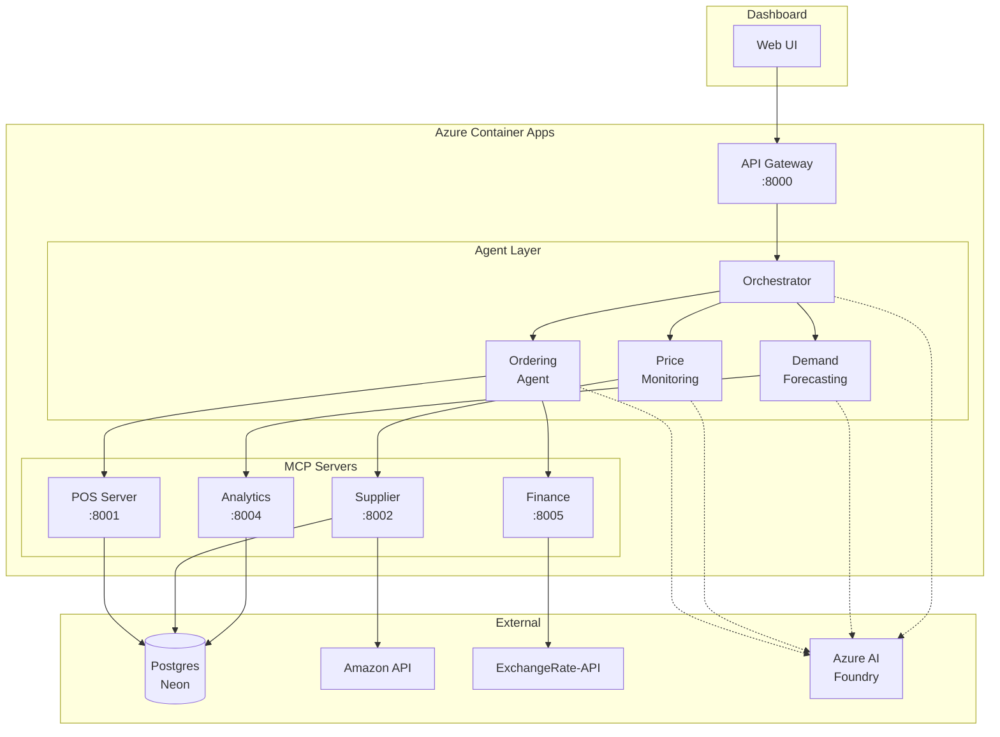
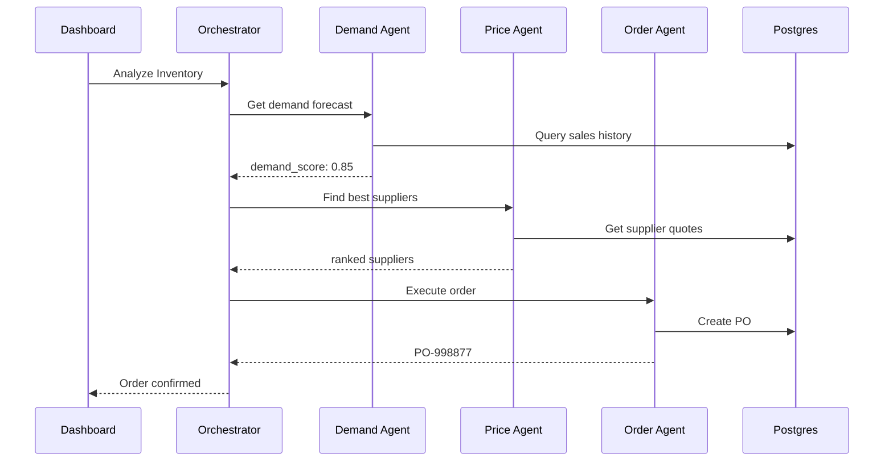

# Multi-Agent Inventory Optimization Platform

## Context

- **Database**: Postgres Neon (suppliers, products, purchase_orders, purchase_order_items)
- **Amazon API**: `amazon-api-app.purplepebble-8d2a2163.eastus.azurecontainerapps.io`
- **Azure AI Foundry**: `bhattaraikusum51-8374`

---

## Architecture Diagram



---

## Workflow Sequence



---

## Project Structure

```
supply-chain-agents/
├── src/
│   ├── __init__.py
│   ├── main.py                 # FastAPI entry point
│   ├── config.py               # Settings (pydantic_settings)
│   ├── orchestrator/
│   │   ├── __init__.py
│   │   └── optimization_workflow.py
│   └── utils/
│       └── llm_factory.py      # LLM client factory
├── mcp-servers/
│   ├── pos-server/
│   ├── supplier-server/
│   ├── analytics-server/
│   └── finance-server/
├── docker-compose.yml
└── pyproject.toml
```

---

## Implementation Guide

### 1. Configuration (config.py)

```python
"""Configuration management using pydantic-settings."""
from typing import Literal, Optional
from pydantic_settings import BaseSettings, SettingsConfigDict

LLMProvider = Literal["azure-openai", "github-models", "ollama-models"]

class Settings(BaseSettings):
    model_config = SettingsConfigDict(
        env_file=".env",
        env_file_encoding="utf-8",
        case_sensitive=False,
        extra="ignore",
    )

    # LLM Provider
    llm_provider: LLMProvider = "azure-openai"
    
    # Azure OpenAI
    azure_openai_endpoint: Optional[str] = None
    azure_openai_api_key: Optional[str] = None
    azure_openai_deployment_name: Optional[str] = None
    azure_openai_api_version: str = "2024-02-15-preview"
    
    # MCP Server URLs
    mcp_pos_url: str = "http://pos-server:8001"
    mcp_supplier_url: str = "http://supplier-server:8002"
    mcp_analytics_url: str = "http://analytics-server:8004"
    mcp_finance_url: str = "http://finance-server:8005"
    
    # Server
    port: int = 8000
    log_level: str = "INFO"
    
    # OpenTelemetry
    otel_service_name: str = "supply-chain-agents"
    otel_exporter_otlp_endpoint: Optional[str] = None

settings = Settings()
```

---

### 2. FastAPI Entry Point (main.py)

```python
"""FastAPI application with MAF workflow orchestration."""
import logging
from contextlib import asynccontextmanager
from typing import AsyncGenerator

from fastapi import FastAPI
from fastapi.middleware.cors import CORSMiddleware

from config import settings
from orchestrator import optimization_orchestrator

logging.basicConfig(level=settings.log_level)
logger = logging.getLogger(__name__)

@asynccontextmanager
async def lifespan(app: FastAPI) -> AsyncGenerator[None, None]:
    """Manage application lifespan events."""
    logger.info("Starting Supply Chain Agents API")
    logger.info(f"LLM Provider: {settings.llm_provider}")
    
    # Initialize workflow orchestrator
    try:
        await optimization_orchestrator.initialize()
        logger.info("✓ Optimization workflow ready")
    except Exception as e:
        logger.error(f"❌ Error initializing workflow: {e}")
    
    yield
    
    logger.info("Shutting down Supply Chain Agents API")

app = FastAPI(
    title="Supply Chain Agents API",
    description="Multi-agent inventory optimization using Microsoft Agent Framework",
    version="1.0.0",
    lifespan=lifespan,
)

app.add_middleware(
    CORSMiddleware,
    allow_origins=["*"],
    allow_methods=["*"],
    allow_headers=["*"],
)

@app.post("/api/optimize")
async def optimize_inventory(request: dict):
    """Run the full optimization workflow."""
    user_message = request.get("query", "Analyze inventory and suggest orders")
    
    events = []
    async for event in optimization_orchestrator.run_workflow(user_message):
        events.append(event)
    
    return {"events": events}
```

---

### 3. Optimization Workflow (orchestrator/optimization_workflow.py)

```python
"""Multi-agent workflow using Microsoft Agent Framework."""
import asyncio
import logging
from typing import Any, AsyncGenerator, Dict, Optional

from agent_framework import ChatAgent, MagenticBuilder
from agent_framework.tools import MCPStreamableHTTPTool
from azure.ai.inference import ChatCompletionsClient
from azure.core.credentials import AzureKeyCredential

from config import settings

logger = logging.getLogger(__name__)

class OptimizationOrchestrator:
    """Orchestrates the supply chain optimization workflow."""
    
    def __init__(self):
        self.chat_client: Optional[ChatCompletionsClient] = None
        self.initialized = False
    
    async def initialize(self):
        """Initialize LLM client and MCP tools."""
        # Create Azure OpenAI client
        self.chat_client = ChatCompletionsClient(
            endpoint=settings.azure_openai_endpoint,
            credential=AzureKeyCredential(settings.azure_openai_api_key),
        )
        self.initialized = True
        logger.info("✓ Optimization orchestrator initialized")
    
    def _create_mcp_tool(self, name: str, url: str) -> Optional[MCPStreamableHTTPTool]:
        """Create MCP tool for connecting to MCP servers."""
        try:
            return MCPStreamableHTTPTool(
                name=name,
                url=url,
                load_tools=True,
                load_prompts=False,
                request_timeout=30,
                approval_mode="never_require",
            )
        except Exception as e:
            logger.warning(f"⚠ Could not create MCP tool {name}: {e}")
            return None
    
    async def run_workflow(self, user_message: str) -> AsyncGenerator[Dict[str, Any], None]:
        """Execute the optimization workflow with streaming events."""
        
        # Create MCP tools for each server
        pos_tool = self._create_mcp_tool("pos_mcp", settings.mcp_pos_url)
        supplier_tool = self._create_mcp_tool("supplier_mcp", settings.mcp_supplier_url)
        analytics_tool = self._create_mcp_tool("analytics_mcp", settings.mcp_analytics_url)
        finance_tool = self._create_mcp_tool("finance_mcp", settings.mcp_finance_url)
        
        # Build workflow with specialized agents
        workflow = (
            MagenticBuilder()
            .participants(
                DemandForecastingAgent=ChatAgent(
                    name="DemandForecastingAgent",
                    description="Predicts inventory demand using historical data and Prophet",
                    instructions=(
                        "You are a Demand Forecasting Agent. "
                        "Analyze historical sales and predict future demand. "
                        "Use the analytics MCP tools for forecasting. "
                        "Return demand scores and recommended quantities."
                    ),
                    chat_client=self.chat_client,
                    tools=[pos_tool, analytics_tool],
                ),
                PriceMonitoringAgent=ChatAgent(
                    name="PriceMonitoringAgent",
                    description="Compares supplier prices and finds best deals",
                    instructions=(
                        "You are a Price Monitoring Agent. "
                        "Query supplier prices and rank by cost/quality/speed. "
                        "Use get_realtime_quotes, fuzzy_match_suppliers, rank_by_criteria. "
                        "Return the best supplier recommendations."
                    ),
                    chat_client=self.chat_client,
                    tools=[supplier_tool, finance_tool],
                ),
                OrderingAgent=ChatAgent(
                    name="OrderingAgent",
                    description="Executes optimized purchase orders",
                    instructions=(
                        "You are an Ordering Agent. "
                        "Optimize cart, validate budget, and execute orders. "
                        "Use simulate_cart_permutations, execute_order, update_inventory. "
                        "Return order confirmation with PO number."
                    ),
                    chat_client=self.chat_client,
                    tools=[pos_tool, finance_tool],
                ),
            )
            .with_standard_manager(
                chat_client=self.chat_client,
                max_round_count=8,
                max_stall_count=2,
            )
            .build()
        )
        
        # Stream workflow events
        async for event in workflow.run_stream(user_message):
            event_data = self._convert_event(event)
            if event_data:
                yield event_data
    
    def _convert_event(self, event: Any) -> Optional[Dict[str, Any]]:
        """Convert workflow event to API format."""
        event_type = type(event).__name__
        
        if hasattr(event, 'agent_id'):
            return {
                "type": "agent_event",
                "agent": event.agent_id,
                "event": event_type,
                "data": {"message": getattr(event, 'text', str(event))},
            }
        
        return None

# Global orchestrator instance
optimization_orchestrator = OptimizationOrchestrator()
```

---

### 4. MCP Server Template (mcp-servers/supplier-server/server.py)

```python
"""Supplier MCP Server - Provides price query tools."""
from fastapi import FastAPI
from pydantic import BaseModel
import httpx
from thefuzz import fuzz

app = FastAPI(title="Supplier MCP Server")

AMAZON_API = "https://amazon-api-app.purplepebble-8d2a2163.eastus.azurecontainerapps.io"

class QuoteRequest(BaseModel):
    items: list[str]
    limit: int = 5

@app.get("/tools")
async def list_tools():
    """MCP tool discovery endpoint."""
    return {
        "tools": [
            {"name": "get_realtime_quotes", "description": "Get supplier prices"},
            {"name": "fuzzy_match_suppliers", "description": "Match SKUs"},
            {"name": "rank_by_criteria", "description": "Rank suppliers"},
        ]
    }

@app.post("/tools/get_realtime_quotes")
async def get_realtime_quotes(request: QuoteRequest):
    """Query Amazon API for live pricing."""
    async with httpx.AsyncClient() as client:
        quotes = []
        for item in request.items:
            resp = await client.get(
                f"{AMAZON_API}/products",
                params={"query": item, "limit": request.limit}
            )
            quotes.extend(resp.json())
    return {"quotes": quotes}

@app.post("/tools/fuzzy_match_suppliers")
async def fuzzy_match_suppliers(target_sku: str, catalogs: list):
    """Match SKUs using fuzzy matching."""
    matches = []
    for catalog in catalogs:
        score = fuzz.ratio(target_sku.lower(), catalog["sku"].lower())
        if score > 75:
            matches.append({"supplier": catalog["name"], "confidence": score / 100})
    return sorted(matches, key=lambda x: x["confidence"], reverse=True)

@app.post("/tools/rank_by_criteria")
async def rank_by_criteria(quotes: list, weights: dict = None):
    """Rank suppliers by weighted criteria."""
    weights = weights or {"cost": 0.5, "speed": 0.3, "quality": 0.2}
    for q in quotes:
        q["score"] = (
            (1 - q.get("price_cleaned", 0) / 1000) * weights["cost"] +
            q.get("rating", 0) / 5 * weights["quality"]
        )
    return sorted(quotes, key=lambda x: x["score"], reverse=True)
```

---

### 5. Docker Compose

```yaml
version: '3.8'

services:
  api:
    build: .
    ports: ["8000:8000"]
    environment:
      - AZURE_OPENAI_ENDPOINT=${AZURE_OPENAI_ENDPOINT}
      - AZURE_OPENAI_API_KEY=${AZURE_OPENAI_API_KEY}
      - DATABASE_URL=${DATABASE_URL}
    depends_on:
      - pos-server
      - supplier-server
      - analytics-server
      - finance-server

  pos-server:
    build: ./mcp-servers/pos-server
    ports: ["8001:8001"]
    environment:
      - DATABASE_URL=${DATABASE_URL}

  supplier-server:
    build: ./mcp-servers/supplier-server
    ports: ["8002:8002"]

  analytics-server:
    build: ./mcp-servers/analytics-server
    ports: ["8004:8004"]
    volumes:
      - ./models:/app/models

  finance-server:
    build: ./mcp-servers/finance-server
    ports: ["8005:8005"]
    environment:
      - EXCHANGE_API_KEY=${EXCHANGE_API_KEY}
```

---

## Key Dependencies

```toml
# pyproject.toml
[project]
dependencies = [
    "fastapi>=0.109.0",
    "uvicorn>=0.27.0",
    "pydantic-settings>=2.0.0",
    "agent-framework[azure-ai]>=0.1.0",
    "azure-ai-inference>=1.0.0",
    "azure-identity>=1.15.0",
    "httpx>=0.27.0",
    "thefuzz>=0.22.0",
    "opentelemetry-api>=1.24.0",
]
```
